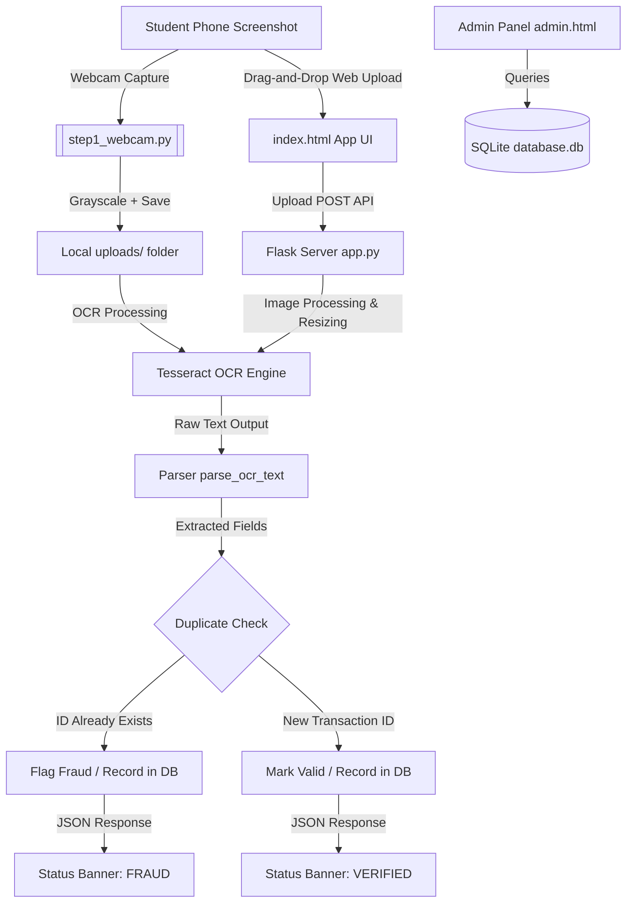

# Real-Time Offline Payment Screenshot Verification & Fraud Detection System

A robust, real-time, and completely offline verification system designed to prevent payment screenshot fraud (such as screenshot reuse, digital fabrication, and replay attacks) in university canteens and retail setups. Using computer vision, OCR text extraction, and a local SQLite database, the system validates digital transaction receipts instantly.

---

## Project Purpose & Problem Statement

In busy retail environments (like university canteens during rush hours), cashiers often struggle to manually verify the authenticity of mobile payments (e.g., Easypaisa, JazzCash, bank transfers). This leads to financial leakage via:
* **Replay Attacks**: Reusing the same payment confirmation screenshot multiple times.
* **Fabricated Screenshots**: Modifying text elements (amounts, names, dates) on a legitimate confirmation image.
* **Expired Proofs**: Displaying ancient transactions as if they just occurred.

This system provides a **100% offline, high-speed solution** that captures/accepts screenshots, extracts crucial transaction metadata via OCR, and cross-references it with local transaction records. If a duplicate Transaction ID is detected, it flags the transaction as fraudulent, records the incident, and alerts the operator.

---

## System Architecture & Workflow

The following diagram illustrates the interaction between the student showing their phone, the input modules (webcam/manual upload), the extraction backend, and the local validation engine.



---

## Key Features

* **Interactive Web Interface**: A sleek, dark-themed dashboard built with Google Inter font. It supports clicking and drag-and-drop file uploads, image preview, visual loader, and collapsible raw OCR debug views.
* **Instant Verification Banners**: Visual status indicators (`✅ VERIFIED` in green, `❌ Duplicate Transaction Detected!` in red) to provide rapid cashier feedback.
* **Webcam Verification Script**: A separate command-line tool with a live video feed, allowing real-time snapshot captures with immediate console feedback.
* **Transaction Extraction Parser**: Regex-driven heuristics to parse Transaction ID, Sender Name, Receiver Name, Total Amount, and Timestamp.
* **Admin Dashboard**: A secure statistics panel compiling total transactions processed, cumulative revenue (automatically formatted), and fraud attempts caught.
* **Offline Security & Data Protection**: Processes all operations locally (no data sent to cloud APIs), storing entries in a local SQLite file.

---

## File Structure Reference

Here are the key files inside the workspace:

* [requirements.txt](file:///c:/Users/umer5/Documents/AiProjects/fakeSSDetector/requirements.txt) - List of required Python dependencies.
* [app.py](file:///c:/Users/umer5/Documents/AiProjects/fakeSSDetector/app.py) - The main Flask backend server handling web uploads, OCR pipelines, and endpoints.
* [database.py](file:///c:/Users/umer5/Documents/AiProjects/fakeSSDetector/database.py) - Helper functions for SQLite database connections, metrics tracking, and schema migrations.
* [step1_webcam.py](file:///c:/Users/umer5/Documents/AiProjects/fakeSSDetector/step1_webcam.py) - A CLI utility implementing a live OpenCV webcam feed to capture and process screenshots on keypress.
* `templates/` - Contains the HTML presentation templates:
  * [index.html](file:///c:/Users/umer5/Documents/AiProjects/fakeSSDetector/templates/index.html) - Standard payment upload portal.
  * [admin.html](file:///c:/Users/umer5/Documents/AiProjects/fakeSSDetector/templates/admin.html) - Stats panel summarizing verified revenue and fraudulent incidents.
  * [how_it_works.html](file:///c:/Users/umer5/Documents/AiProjects/fakeSSDetector/templates/how_it_works.html) - Documentation and breakdown of the detection flow.
* `uploads/` - Storage location for saved webcam snapshots and manual file uploads.

---

## Prerequisites & Installation Guide

Follow these steps to configure your environment and run the application.

### Step 1: Install Tesseract OCR Engine (Required)
Tesseract is an open-source OCR engine that must be installed on your operating system:

* **Windows**:
  1. Download the installer from the [UB-Mannheim Tesseract Wiki](https://github.com/UB-Mannheim/tesseract/wiki).
  2. Run the installer and remember the installation directory (usually `C:\Program Files\Tesseract-OCR`).
  3. **Crucial**: Add `C:\Program Files\Tesseract-OCR` to your System Environment variables PATH.
* **macOS**:
  ```bash
  brew install tesseract
  ```
* **Linux (Ubuntu/Debian)**:
  ```bash
  sudo apt-get update
  sudo apt-get install tesseract-ocr
  ```

### Step 2: Set Up Python Virtual Environment
Navigate to the project root directory and create a virtual environment:

```powershell
# Open your terminal and navigate to the project directory
cd "c:\Users\umer5\Documents\AiProjects\fakeSSDetector"

# Create a virtual environment named venv
python -m venv venv

# Activate the virtual environment
# On Windows (CMD/Powershell):
venv\Scripts\activate

# On macOS/Linux:
source venv/bin/activate
```

### Step 3: Install Required Python Libraries
Install all necessary packages using the provided [requirements.txt](file:///c:/Users/umer5/Documents/AiProjects/fakeSSDetector/requirements.txt):

```powershell
pip install -r requirements.txt
```

---

## How to Run the Application

### Option A: Running the Web Interface (Recommended)
This runs the full Flask server on your local machine and serves the web frontend:

1. Launch the server script:
   ```powershell
   python app.py
   ```
2. Once running, open your web browser and navigate to:
   * **Main Scanner**: `http://127.0.0.1:5000/`
   * **Admin Metrics Panel**: `http://127.0.0.1:5000/admin`
   * **How it Works Guide**: `http://127.0.0.1:5000/how-it-works`
3. Drag and drop any transaction receipt image into the scanner, then click **Extract Transaction Data**.

### Option B: Running the Live Webcam Capture Tool
This mode utilizes your system's webcam to capture snapshots of transaction screens:

1. Launch the webcam script:
   ```powershell
   python step1_webcam.py
   ```
2. A window titled **Live Payment Verification Feed** will open.
3. Position the phone screenshot in front of the lens.
4. **Controls**:
   * Press **`c`** to capture the current frame, save it to [uploads/](file:///c:/Users/umer5/Documents/AiProjects/fakeSSDetector/uploads), and trigger OCR text parsing.
   * Press **`q`** to safely stop the feed and exit the program.

---

## SQLite Database Structure

The database `database.db` contains two tables created during startup:

### 1. `transactions`
Stores all validated, unique payment screens.
| Column | Type | Description |
|---|---|---|
| `id` | INTEGER | Primary Key (Autoincrement) |
| `transaction_id` | TEXT | Unique transaction identifier |
| `sender_name` | TEXT | Extracted name of payer |
| `receiver_name` | TEXT | Extracted name of recipient |
| `amount` | TEXT | Paid amount (clean string) |
| `date_time` | TEXT | Timestamp extracted from transaction screen |
| `scanned_at` | TIMESTAMP | Record timestamp (Default: Current Time) |

### 2. `fraud_transactions`
Logs duplicate screenshots flagged during verification scans.
| Column | Type | Description |
|---|---|---|
| `id` | INTEGER | Primary Key (Autoincrement) |
| `transaction_id` | TEXT | Duplicate identifier associated with fraud |
| `sender_name` | TEXT | Extracted payer name |
| `receiver_name` | TEXT | Extracted recipient name |
| `amount` | TEXT | Extracted amount |
| `date_time` | TEXT | Extracted screenshot date |
| `detected_at` | TIMESTAMP | Fraud log timestamp (Default: Current Time) |

---

## Troubleshooting Guide

### 1. `TesseractNotFoundError`
**Error Message**: `pytesseract.pytesseract.TesseractNotFoundError: tesseract is not installed or it's not in your PATH`
* **Fix**: Ensure you have installed Tesseract (Step 1). If it is installed but not detected, you can explicitly define the path in [app.py](file:///c:/Users/umer5/Documents/AiProjects/fakeSSDetector/app.py) or [step1_webcam.py](file:///c:/Users/umer5/Documents/AiProjects/fakeSSDetector/step1_webcam.py) before calls:
  ```python
  import pytesseract
  pytesseract.pytesseract.tesseract_cmd = r'C:\Program Files\Tesseract-OCR\tesseract.exe'
  ```

### 2. Camera Fails to Open
**Error Message**: `Error: Could not open the webcam.`
* **Fix**:
  1. Ensure the camera is plugged in and no other applications (Zoom, Teams, Discord) are utilizing it.
  2. Change the camera index in [step1_webcam.py](file:///c:/Users/umer5/Documents/AiProjects/fakeSSDetector/step1_webcam.py) from `0` to `1` or `2`:
     ```python
     cap = cv2.VideoCapture(1) # Change 0 to 1, 2, or 3
     ```

### 3. OCR Performance & Accuracy Improvement
If Tesseract is having difficulty reading amounts or IDs:
* Ensure lighting is uniform and the phone screen is not reflecting bright glare directly back at the camera sensor.
* The system automatically resizes image inputs by $2\times$ and uses binary thresholding inside [app.py](file:///c:/Users/umer5/Documents/AiProjects/fakeSSDetector/app.py) to prevent light names from washing out. You can adjust the threshold value on line 51 of `app.py` if needed.
